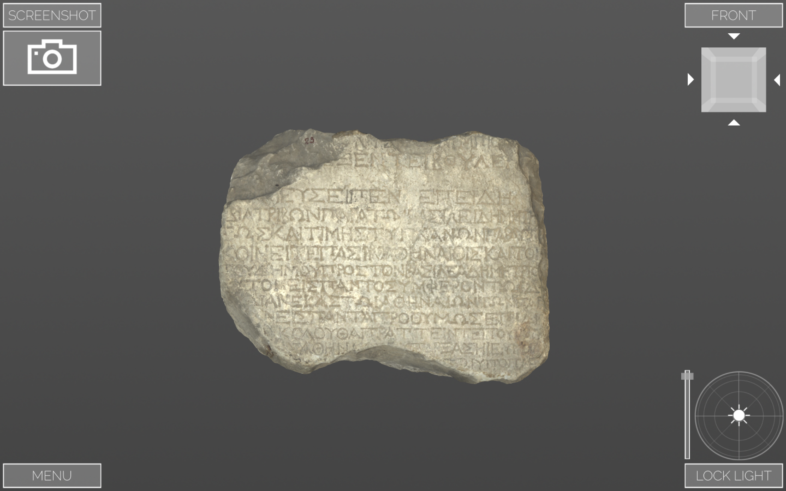
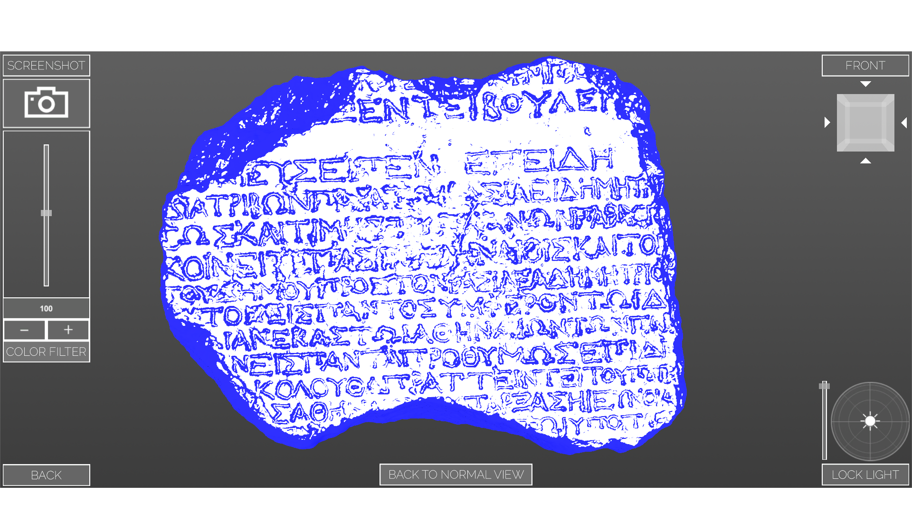
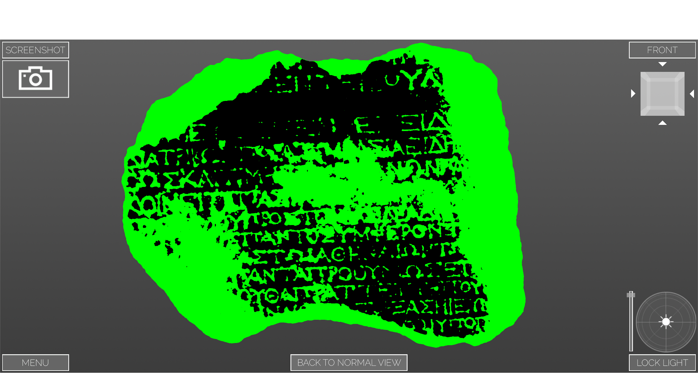

# VisualFacts

|  | 
|:--:| 
| *Demo on Youtube* |

## Project Team
- Ruben Adleff
- Marc-Philipp Scholz
- Luka Sommerfeld
### Supervision
- Sebastian Rings
- Paul Lubos

## Goal
The goal of our project was to develop a program helping historians to read and analyze historic, written-on stone artifacts. Since working with the real artifact requires physical access to it, the idea of VisualFacts is to use 3D-scans rather than the real artifact. The main focus of VisualFacts lies on usability and simplicity, as it was designed to be a practical tool in the daily work context of historians.

## Standalone Builds
- [VisualFacts_1.0.zip](VisualFacts%20Unity/VisualFacts%20Build/VisualFacts_1.0.zip)

## Info
If you do want to work with the code please note that part of it is ignored due to a purchased Asset. Also for commercial uses, please contact one of the [authors](mailto:lubos@informatik.uni-hamburg.de).

## Approach
To ensure the usefulness of VisualFacts to the target group, we worked closely together with historians of Universität Hamburg. The cooperation resulted in both translation of common methods from the real into the virtual world, as well as in the creation of new analyzing methods. 
The core of the program is the direct interaction with an artifact through either multitouch input or mouse and keyboard. This allows to freely rotate, scale and translate any object and ensure a detailed view on the object from any angle. First created with a touch table in mind, the input was optimized for mouse input since the historians we worked with use their office computers with mouse and keyboard. 

|  | 
|:--:| 
| *The workspace of VisualFacts* |

VisualFacts also offers a detailed lighting feature. A light source can be positioned shining down on an artifact from any angle and with adjustable brightness. Since both positioning an artifact and looking at it from different angles are the same interaction in the program, the user can fix the lights position relative to the object, creating easy-towork-with lighting conditions 
We also implemented two shaders that simplify the reading and analyzing process. The angle shader colors in every part of an artifact that is not parallel to the screen and thus colors in writing efficiently. The plane shader enables the user to raise and lower a plane through the artifact, coloring everything that lies beneath that plane. This way, something similar to a depth-map of the artifact is visualized. 

|  | 
|:--:| 
| *Using the angle shader* |

|  | 
|:--:| 
| *Using the plane shader* |

Other functionalities include a navigation cube, a screenshot feature and an importer.

## Evaluation
Evaluating VisualFacts together with the historians we collaborated with showed, that VisualFacts fulfills the usability and simplicity needs specified by them. Even though it is simple in design, the program offers powerful features and thus can be a useful tool for people working with historic, written-on stone artifacts. It also has the potential to reduce both cost and time when working with any object. 
All in all VisualFacts and similar programs can aid historians in their work with artifacts. They do not only eliminate the need of physical access to artifacts, but also speed up the analyzing process and offer features not realizable with common methods in the real world.

## License
[Link](LICENCE)
